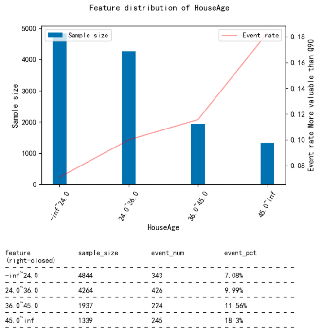

---

sort: 2
---


# Quick Start

This part introduces the main features of Scorecard-Bundle, including feature discretization, WOE encoding, discretization adjustment, feature selection, scorecard training/adjustment, and model interpretation. Users can quickly develop their first scorecard model following the instructions in Quick Start, but in practice some tricks is often needed to deal with various challenges (e.g. performing ChiMerge discretization to all features requires high computation cost, and adjusting discretization is very time-consuming and labor-intensive without automation tools). Please refer to the complete code examples for the best practice to building scorecard models.

- Like Scikit-Learn, Scorecard-Bundle basically have two types of objects, transformers and predictors, which comply with the fit-transform and fit-predict convention;
- Complete code examples showing how to build a scorecard with Scorecard-Bundle can be found in [Example Notebooks](https://scorecard-bundle.bubu.blue/Notebooks/);
- See more details in [API Reference](https://scorecard-bundle.bubu.blue/API/);
- Note that the feature intervals in Scorecard-Bundle are open to the left and close to the right.


## Load Scorecard-Bundle

```python
from scorecardbundle.feature_discretization import ChiMerge as cm
from scorecardbundle.feature_discretization import FeatureIntervalAdjustment as fia
from scorecardbundle.feature_encoding import WOE as woe
from scorecardbundle.feature_selection import FeatureSelection as fs
from scorecardbundle.model_training import LogisticRegressionScoreCard as lrsc
from scorecardbundle.model_evaluation import ModelEvaluation as me
from scorecardbundle.model_interpretation import ScorecardExplainer as mise
```

## Feature Discretization (ChiMerge)

Scorecard-Bundle applies ChiMerge algorithm (introduced by Randy Kerber in "ChiMerge: Discretization of Numeric Attributes") for feature discretization. ChiMerge is a bottom-up discretization algorithm based on the feature's distribution and the target classes' relative frequencies in each feature value. As a result, it keep statistically significantly different intervals and merge similar ones. The discretization step turns numerical features into intervals or merge similar values of ordinal features. Categorical features should be encoded into ordinal features before this step(e.g. encodings with event rate rankings).

By default, equal-frequency binning is used as a pre-step to `ChiMerge` since using `ChiMerge` directly tends to output highly-imbalanced feature values (some values of the feature have few samples) 

As shown below, we can initialize a `ChiMerge` instance and fit it to data. `max_intervals` and `min_intervals` control the number of unique output intervals for each feature. `decimal` controls the number of decimals of boundaries. Check the [API Reference](https://scorecard-bundle.bubu.blue/API/) for rest of parameters of `ChiMerge`.

```python
trans_cm = cm.ChiMerge(max_intervals=10, min_intervals=2, decimal=3, output_dataframe=True)
result_cm = trans_cm.fit_transform(X, y) 
trans_cm.boundaries_ # see the interval boundaries for each feature
```

Like any transformer in sklearn, `ChiMerge`  supports:

- `fit()`: Fitting the data. Get the optimized discretization for each feature. e.g. `trans_cm.fit(X,y)`
- `transform()`: transform original features to discretized ones using learnt discretization. e.g. `trans_cm.transform(X)`
- `fit_transform()`: Fit and transform the features at once. e.g. `trans_cm.fit_transform(X,y)`

## Feature Encoding (WOE) 

Weight of Evidence (WOE) is the logarithm of the quotient of dependent variable's local distribution on each feature value divided by its global distribution. It represents the difference between the local event rate of each feature value and the global event rate.  This means the values of WOE encodings is linear to the discriminative power of feature values and therefore performing WOE encoding enables regression models to better capture non-linear patterns.

Information value (IV) is calculated for features as a byproduct of WOE. IV is a commonly-used metric that represents a feature's discriminative power towards a binary target.  IV can be accessed from the `iv_` attribute after training `WOE_Encoder`

Check the [API Reference](https://scorecard-bundle.bubu.blue/API/) for calculation details and parameter introduction.


```python
trans_woe = woe.WOE_Encoder(output_dataframe=True)
result_woe = trans_woe.fit_transform(result_cm, y)
print(trans_woe.iv_) # information value (iv) for each feature
print(trans_woe.result_dict_) # woe dictionary and iv value for each feature

# IV result
res_iv = pd.DataFrame.from_dict(trans_woe.iv_, orient='index').sort_values(0,ascending=False).reset_index()
res_iv.columns = ['feature','IV']
```

## Discretization Adjustment

For a Scorecard model, we usually have the following expectations from a feature:
- The feature should have acceptable level of  discriminative power (e.g. IV>0.02);
- The feature distribution shouldn't be highly imbalanced (e.g. all feature values shouldn't have too few samples);
- The event rate curve of the feature is often monotonic or quadratic so that the pattern can be easily interpreted by human;
- The trend of the event rate curve should be inconsistent with that of feature value distribution.  Statistically speaking, assuming a feature has no discriminative power upon a dependent variable, the feature value that accounts for a small proportion of total samples is usually more likely to have a lower event rate then the value that dominate the distribution, especially when the dependent variable is imbalanced. Therefore when the direction of event rate curve is consistent with the direction of feature value distribution, we are not certain that whether the feature has some sort of discriminative power, or the low event rates in less-dominant feature values are simply due to the fact that  less-dominant feature values cover a smaller region of the feature value distribution and are therefore less likely to encounter the samples with positive dependent variable;

In the Discretization Adjustment step, check the sample distribution and event rate distribution for each feature, and then adjust the feature intervals to meet the above expectations.

### Check the sample distribution and event rate distribution 

Use `plot_event_dist()` function can easily visualize the feature's distribution, including the sample size and event rate of each feature value.

```python
col = 'HouseAge'
fia.plot_event_dist(result_cm[col],y,x_rotation=60)
```


### Adjust the feature intervals

Now that new boundaries for feature discretization has been determined based on the plot above, we can use `assign_interval_str()` function to pass user-defined boundaries to the original feature values and get the new discretized feature.

```python
new_x = cm.assign_interval_str(X[col].values,[24,36,45]) # apply new interval boundaries to the feature
woe.woe_vector(new_x, y.values) # check the information value of the resulted feature that applied the new intervals
```

```
({'-inf~24.0': -0.37674091199664517,
'24.0~36.0': -0.0006838162136153891,
'36.0~45.0': 0.16322806760041855,
'45.0~inf': 0.7012457415969229},
 0.12215245735367213)
```

### Check the distributions again

```python
fia.plot_event_dist(new_x,y
                  ,title=f'Feature distribution of {col}'
                  ,x_label=col
                  ,y_label='More valuable than Q90'
                  ,x_rotation=60
                 ,save=False # Set to True if want to save to local position
                 ,file_name=col # filename in the case saving to local position
                 ,table_vpos=-0.6 # The smaller the value is, the further down the table's pisition will be
                   ) 
```



### Update the dataset of discretized features

Update the dataset of discretized features. Once finishing adjusting features, this dataset will be encoded with WOE and then fitted to the Logistic regression model.

```python
result_cm[col] = new_x # Update with adjusted features
feature_list.append(col) # The list that records the selected features
```

### WOE on the interval-adjusted feature data

After finishing interval adjustments for all features, perform WOE encoding to the adjusted feature data

```python
trans_woe = woe.WOE_Encoder(output_dataframe=True)
result_woe = trans_woe.fit_transform(result_cm[feature_list], y) 
result_woe.head()
```

|      |  Latitude |  HouseAge | Population | Longitude |  AveRooms |
| ---: | --------: | --------: | ---------: | --------: | --------: |
|    0 |  0.016924 |  0.163228 |   0.060771 | -0.374600 | -0.660410 |
|    1 |  0.016924 | -0.376741 |  -0.231549 | -0.374600 | -0.660410 |
|    2 |  0.016924 |  0.163228 |  -0.231549 | -0.374600 | -0.660410 |
|    3 | -0.438377 | -0.000684 |   0.060771 |  0.402336 |  0.724149 |
|    4 |  0.016924 |  0.163228 |  -0.231549 | -0.374600 | -0.660410 |

```python
trans_woe.iv_ # the information value (iv) for each feature
```

```
{'Latitude': 0.08626935922214038,
 'HouseAge': 0.12215245735367213,
 'Population': 0.07217596403800937,
 'Longitude': 0.10616009747356592,
 'AveRooms': 0.7824038737089276}
```

## Feature selection

The purpose of  feature selection step is mainly mitigate the co-linearity problem caused by correlated features in regression models. After Identifying highly-correlated feature pairs, the feature with lower IV within each pair is dropped. There are 3 tools in Scorecard-Bundle that built for this purpose:

- Function `selection_with_iv_corr()` sort features by their IVs and identifies other features that are highly-correlated with the feature; 
- Function `identify_colinear_features()` identifies highly-correlated feature pairs and the feature to drop within each pair; 
- Function `unstacked_corr_table()` returns all feature pairs sorted by their correlation coefficient.

Note that Pearson Correlation Coefficient is used to measure the correlation between features.

```python
fs.selection_with_iv_corr(trans_woe, result_woe,threshold_corr=0.7) # column 'corr_with' lists the other features that are highly correlated with the feature 
```

|      |     factor |        IV |                                          woe_dict |                                         corr_with |
| ---: | ---------: | --------: | ------------------------------------------------: | ------------------------------------------------: |
|    2 |   AveRooms | 47.130083 | {0.8461538461538461: -23.025850929940457, 1.0:... | {'MedInc': 0.886954762287924, 'AveBedrms': 0.8... |
|    5 |   AveOccup | 45.534320 | {1.0892678034102308: -23.025850929940457, 1.08... | {'MedInc': 0.8654189306421639, 'AveRooms': 0.9... |
|    0 |     MedInc | 41.907477 | {0.4999: -23.025850929940457, 0.536: -23.02585... | {'AveRooms': 0.886954762287924, 'AveBedrms': 0... |
|    3 |  AveBedrms | 37.630560 | {0.4444444444444444: -23.025850929940457, 0.5:... | {'MedInc': 0.7527641328927565, 'AveRooms': 0.8... |
|    4 | Population | 16.181549 | {5.0: -23.025850929940457, 6.0: -23.0258509299... |                                                {} |
|    7 |  Longitude |  8.396207 | {-124.35: -23.025850929940457, -124.27: -23.02... |                                                {} |
|    6 |   Latitude |  8.314223 | {32.54: -23.025850929940457, 32.55: -23.025850... |                                                {} |
|    1 |   HouseAge |  0.236777 | {1.0: -23.025850929940457, 2.0: 0.341285523686... |                                                {} |

```python
features_to_drop_auto,features_to_drop_manual,corr_auto,corr_manual = fs.identify_colinear_features(result_woe_raw,trans_woe_raw.iv_,threshold_corr=0.7)
print('The features with lower IVs in highly correlated pairs: ',features_to_drop_auto)
print('The features with equal IVs in highly correlated pairs: ',features_to_drop_manual)
corr_auto # highly correlated feature pairs (with unequal IVs)
```

|      | feature_a | feature_b | corr_coef | iv_feature_a | iv_feature_b |   to_drop |
| ---: | --------: | --------: | --------: | -----------: | -----------: | --------: |
|    0 |    MedInc |  AveRooms |  0.886955 |    41.907477 |    47.130083 |    MedInc |
|    1 |    MedInc | AveBedrms |  0.752764 |    41.907477 |    37.630560 | AveBedrms |
|    2 |    MedInc |  AveOccup |  0.865419 |    41.907477 |    45.534320 |    MedInc |
|    3 |  AveRooms |    MedInc |  0.886955 |    47.130083 |    41.907477 |    MedInc |
|    4 |  AveRooms | AveBedrms |  0.827336 |    47.130083 |    37.630560 | AveBedrms |
|    5 |  AveRooms |  AveOccup |  0.952849 |    47.130083 |    45.534320 |  AveOccup |
|    6 | AveBedrms |    MedInc |  0.752764 |    37.630560 |    41.907477 | AveBedrms |
|    7 | AveBedrms |  AveRooms |  0.827336 |    37.630560 |    47.130083 | AveBedrms |
|    8 | AveBedrms |  AveOccup |  0.811198 |    37.630560 |    45.534320 | AveBedrms |
|    9 |  AveOccup |    MedInc |  0.865419 |    45.534320 |    41.907477 |    MedInc |
|   10 |  AveOccup |  AveRooms |  0.952849 |    45.534320 |    47.130083 |  AveOccup |
|   11 |  AveOccup | AveBedrms |  0.811198 |    45.534320 |    37.630560 | AveBedrms |


```python
# Return the unstacked correlation table for all features to help analyze the colinearity problem
fs.unstacked_corr_table(result_woe,trans_woe.iv_)
```

|      | feature_a |  feature_b | corr_coef | abs_corr_coef | iv_feature_a | iv_feature_b |
| ---: | --------: | ---------: | --------: | ------------: | -----------: | -----------: |
|   12 | Longitude |   latitude | -0.464314 |      0.464314 |     0.106160 |     0.086269 |
|    2 |  latitude |  Longitude | -0.464314 |      0.464314 |     0.086269 |     0.106160 |
|    5 |  HouseAge | Population |  0.258828 |      0.258828 |     0.122152 |      0.07217 |
|  ... |       ... |        ... |       ... |           ... |          ... |          ... |

Based on the analysis results above, 'MedInc', 'AveBedrms', and 'AveOccup' are dropped.

```python
feature_list = list(set(features)-set(['MedInc', 'AveBedrms', 'AveOccup']))
print(feature_list)
```

## Model Training

Scorecard-Bundle put scorecard transformation tools together with sklearn's logistic regression in the `LogisticRegressionScoreCard` class, users can train a scorecard model directly with this class (`fit`) and make predictions (`predict`).

A scorecard model uses parameters `basePoints` and `PDO`  to control the center and variability of score distribution. Default choices can be `PDO=-20, basePoints=100` or `PDO=-10, basePoints=60`.

- Base odds  is a ratio criterion (positive class/negative class), users can pass their own base odds via parameter `baseOdds` (e.g. define defaults/normal as 1:60). The number of y=1 divided by that of y=0 in the dependent variable will be used if user did not pass a value to  `baseOdds` .
- `PDO` is the score changes when the base odds doubles. Its absolute value is  in proportion to the variability of score distribution. When `PDO`  is negative, the higher the model score, the higher the probability that the sample belongs to the positive class. This applies to most binary classification tasks;  When `PDO`  is positive, the higher the model score, the lower the probability that the sample belongs to the positive class. This applies to conventional credit modeling situation where high score means low-risk samples.
- `basePoints` is the expected score of base odds. It determines the center of the score distribution.

Also,  `LogisticRegressionScoreCard` class accepts all parameters of `sklearn.linear_model.LogisticRegression` and its `fit()` fucntion accepts all parameters of the `fit()` of `sklearn.linear_model.LogisticRegression` (including `sample_weight`). Thus in practice we can use methods like Grid Search to find a optimal set of parameters for Logistic regression and pass the parameters to `LogisticRegressionScoreCard`  to train a scorecard model.

Now we train a scorecard model.

```python
model = lrsc.LogisticRegressionScoreCard(trans_woe, PDO=-20, basePoints=100, verbose=True)
model.fit(result_woe, y)
```
If User want to define base odds as 1:60

```python
# Users can use `baseOdds` parameter to set base odds. 
# Default is None, where base odds will be calculate using the number of positive class divided by the number of negative class in y
# Assuming Users want base odds to be 1:60 (positive:negative)
model = lrsc.LogisticRegressionScoreCard(trans_woe, PDO=-20, basePoints=100, baseOdds=1/60,
                                         verbose=True,C=0.6,penalty='l2')
model.fit(result_woe, y)
```

After fitting the model, User can access the scoring rules via attribute `woe_df`. Note that the feature intervals (`value` column in the rules table) are all open to the left and close to the right (e.g. 34.0~37.6 means (34.0, 37.6] ). 

```python
model.woe_df_ # the scorecard rules
'''
  	feature: feature name;
  	value: feature intervals that are open to the left and closed to the right;
  	woe: the woe encoding for each feature interval;
  	beta: the regression coefficients for each feature in the Logistic regression;
  	score: the assigned score for each feature interval;
'''
```

|      |    feature |           value |       woe |     beta | score |
| ---: | ---------: | --------------: | --------: | -------: | ----- |
|    0 |   Latitude |       -inf~34.1 |  0.016924 | 1.907463 | 34.0  |
|    1 |   Latitude |      34.1~34.47 |  0.514342 | 1.907463 | 61.0  |
|    2 |   Latitude |     34.47~37.59 |  0.097523 | 1.907463 | 38.0  |
|    3 |   Latitude |       37.59~inf | -0.438377 | 1.907463 | 9.0   |
|    4 |   HouseAge |       -inf~24.0 | -0.376741 | 1.640162 | 15.0  |
|    5 |   HouseAge |       24.0~36.0 | -0.000684 | 1.640162 | 33.0  |
|    6 |   HouseAge |       36.0~45.0 |  0.163228 | 1.640162 | 40.0  |
|    7 |   HouseAge |        45.0~inf |  0.701246 | 1.640162 | 66.0  |
|    8 | Population |      -inf~420.0 |  0.168914 | 0.464202 | 35.0  |
|    9 | Population |   1274.0~2812.0 | -0.231549 | 0.464202 | 30.0  |
|   10 | Population |      2812.0~inf | -0.616541 | 0.464202 | 24.0  |
|   11 | Population |     420.0~694.0 |  0.277570 | 0.464202 | 36.0  |
|   12 | Population |     694.0~877.0 |  0.354082 | 0.464202 | 37.0  |
|   13 | Population |    877.0~1274.0 |  0.060771 | 0.464202 | 34.0  |
|   14 |  Longitude |     -118.37~inf | -0.374600 | 1.643439 | 15.0  |
|   15 |  Longitude | -121.59~-118.37 |  0.056084 | 1.643439 | 35.0  |
|   16 |  Longitude |    -inf~-121.59 |  0.402336 | 1.643439 | 52.0  |
|   17 |   AveRooms |       -inf~5.96 | -0.660410 | 1.124053 | 11.0  |
|   18 |   AveRooms |      5.96~6.426 |  0.120843 | 1.124053 | 37.0  |
|   19 |   AveRooms |      6.426~6.95 |  0.724149 | 1.124053 | 56.0  |
|   20 |   AveRooms |       6.95~7.41 |  1.261640 | 1.124053 | 74.0  |

## Scorecard Adjustment

Users can manually adjust the Scorecard rules (as shown below, or output excel files to local position, edit it in excel and load it back to Python), and use `load_scorecard`parameter of predict() to load the adjusted rule table. See details in the documentation of `load_scorecard`.

Assuming we want to change the highest score for `AveRooms` from 92 to 91.

```python
sc_table = model.woe_df_.copy()
sc_table['score'][(sc_table.feature=='AveRooms') & (sc_table.value=='7.41~inf')] = 91
sc_table
```

## Apply the Scorecard

Scorecard should be applied on the original feature values, namely the features before discretization and WOE encoding.

```python
result = model.predict(X[feature_list], load_scorecard=sc_table) # Scorecard should be applied on the original feature values
result_val = model.predict(X_val[feature_list], load_scorecard=sc_table) # Scorecard should be applied on the original feature values
result.head() # if model object's verbose parameter is set to False, predict will only return Total scores
```

|      | Latitude | HouseAge | Population | Longitude | AveRooms | TotalScore |
| ---: | -------: | -------: | ---------: | --------: | -------: | ---------- |
|    0 |     34.0 |     40.0 |       34.0 |      15.0 |     11.0 | 134.0      |
|    1 |     34.0 |     15.0 |       30.0 |      15.0 |     11.0 | 105.0      |
|    2 |     34.0 |     40.0 |       30.0 |      15.0 |     11.0 | 130.0      |
|    3 |      9.0 |     33.0 |       34.0 |      52.0 |     56.0 | 184.0      |
|    4 |     34.0 |     40.0 |       30.0 |      15.0 |     11.0 | 130.0      |


Loading a scorecard rules file from local position to a new kernal:

```python
# OR if we load rules from local position.
sc_table = pd.read_excel('rules')

model = lrsc.LogisticRegressionScoreCard(woe_transformer=None, verbose=True) # Initialize an empty model instance. Pass None to woe_transformer because the predict function does not need it
result = model.predict(X[feature_list], load_scorecard=sc_table) # Scorecard should be applied on the original feature values
result_val = model.predict(X_val[feature_list], load_scorecard=sc_table) # Scorecard should be applied on the original feature values
result.head() # if model object's verbose parameter is set to False, predict will only return Total scores
```

## Model Evaluation

Classification performance on different levels of model scores  (precision/recall/f1/etc.):

```python
me.pref_table(y_val,result_val['TotalScore'].values,thresholds=result['TotalScore'].quantile(np.arange(1,10)/10).values)
```

|      |   y_pred_group | event_num | sample_size | cum_event_num | cum_sample_size | cum_sample_pct | cum_precision | cum_recal |   cum_f1 |
| ---: | -------------: | --------: | ----------: | ------------: | --------------: | -------------: | ------------: | --------: | -------: |
|    9 |   (192.0, inf] |       337 |         794 |           337 |             794 |       0.096172 |      0.424433 |  0.408485 | 0.416306 |
|    8 | (174.0, 192.0] |       143 |         794 |           480 |            1588 |       0.192345 |      0.302267 |  0.581818 | 0.397845 |
|    7 | (163.0, 174.0] |        96 |         891 |           576 |            2479 |       0.300266 |      0.232352 |  0.698182 | 0.348668 |
|    6 | (152.0, 163.0] |        79 |         862 |           655 |            3341 |       0.404675 |      0.196049 |  0.793939 | 0.314450 |
|    5 | (144.0, 152.0] |        53 |         793 |           708 |            4134 |       0.500727 |      0.171263 |  0.858182 | 0.285541 |
|    4 | (134.0, 144.0] |        42 |         740 |           750 |            4874 |       0.590359 |      0.153878 |  0.909091 | 0.263204 |
|    3 | (129.0, 134.0] |        24 |         709 |           774 |            5583 |       0.676235 |      0.138635 |  0.938182 | 0.241573 |
|    2 | (123.0, 129.0] |        25 |         762 |           799 |            6345 |       0.768532 |      0.125926 |  0.968485 | 0.222873 |
|    1 | (109.0, 123.0] |        18 |        1053 |           817 |            7398 |       0.896076 |      0.110435 |  0.990303 | 0.198711 |
|    0 |  (-inf, 109.0] |         8 |         858 |           825 |            8256 |       1.000000 |      0.099927 |  1.000000 | 0.181698 |

Performance plots (K-S curve/ROC curve/ precision recall curve):

```python
# Validation
evaluation = me.BinaryTargets(y_val, result_val['TotalScore'])
evaluation.plot_all()
```


## Model Interpretation

Interpretation the model score of an individual instance.

```python
# Features that contribute 80%+ of total score
imp_fs = mise.important_features(result_val
                 ,feature_names=list(sc_table.feature.unique())
                 ,col_totalscore='TotalScore'
                 ,threshold_method=0.8, bins=None)
result_val['important_features'] = imp_fs

# Features with top n highest score
imp_fs = mise.important_features(result_val
                 ,feature_names=list(sc_table.feature.unique())
                 ,col_totalscore='TotalScore'
                 ,threshold_method=2, bins=None)
result_val['top2_features'] = imp_fs

# Define the prediction threshold based on classification performance
result_val['y_pred'] = result_val['TotalScore'].map(lambda x: 1 if x>152 else 0)
result_val
```

|      | Latitude | HouseAge | Population | Longitude | AveRooms | TotalScore |                                important_features |                           top2_features | y_pred |
| ---: | -------: | -------: | ---------: | --------: | -------: | ---------: | ------------------------------------------------: | --------------------------------------: | ------ |
|    0 |     38.0 |     15.0 |       30.0 |      35.0 |     11.0 |      129.0 | {'Latitude': 38.0, 'Longitude': 35.0, 'Populat... |   {'Latitude': 38.0, 'Longitude': 35.0} | 0      |
|    1 |      9.0 |     15.0 |       30.0 |      35.0 |     11.0 |      100.0 |           {'Longitude': 35.0, 'Population': 30.0} | {'Longitude': 35.0, 'Population': 30.0} | 0      |
|    2 |      9.0 |     15.0 |       34.0 |      52.0 |     11.0 |      121.0 |           {'Longitude': 52.0, 'Population': 34.0} | {'Longitude': 52.0, 'Population': 34.0} | 0      |
|    3 |      9.0 |     66.0 |       36.0 |      52.0 |     11.0 |      174.0 |             {'HouseAge': 66.0, 'Longitude': 52.0} |   {'HouseAge': 66.0, 'Longitude': 52.0} | 1      |
|    4 |     34.0 |     15.0 |       37.0 |      15.0 |     91.0 |      192.0 |            {'AveRooms': 91.0, 'Population': 37.0} |  {'AveRooms': 91.0, 'Population': 37.0} | 1      |
|  ... |      ... |      ... |        ... |       ... |      ... |        ... |                                               ... |                                     ... | ...    |
| 8251 |     34.0 |     33.0 |       37.0 |      15.0 |     37.0 |      156.0 | {'Population': 37.0, 'AveRooms': 37.0, 'Latitu... |  {'Population': 37.0, 'AveRooms': 37.0} | 1      |
| 8252 |      9.0 |     40.0 |       30.0 |      52.0 |     11.0 |      142.0 |             {'Longitude': 52.0, 'HouseAge': 40.0} |   {'Longitude': 52.0, 'HouseAge': 40.0} | 0      |
| 8253 |     34.0 |     15.0 |       24.0 |      15.0 |     37.0 |      125.0 | {'AveRooms': 37.0, 'Latitude': 34.0, 'Populati... |    {'AveRooms': 37.0, 'Latitude': 34.0} | 0      |
| 8254 |      9.0 |     15.0 |       36.0 |      35.0 |     11.0 |      106.0 |           {'Population': 36.0, 'Longitude': 35.0} | {'Population': 36.0, 'Longitude': 35.0} | 0      |
| 8255 |     34.0 |     40.0 |       30.0 |      15.0 |     11.0 |      130.0 |              {'HouseAge': 40.0, 'Latitude': 34.0} |    {'HouseAge': 40.0, 'Latitude': 34.0} | 0      |

  

Now we can interpret model scores based on the analysis above. For example, the 4th entry (index=3) has a total score of 174. The primary driver of house value in this case is housing age ('HouseAge') and position('Longitude') because they contribute more than 80% of the total score (also they are the 2 features with the highest scores).